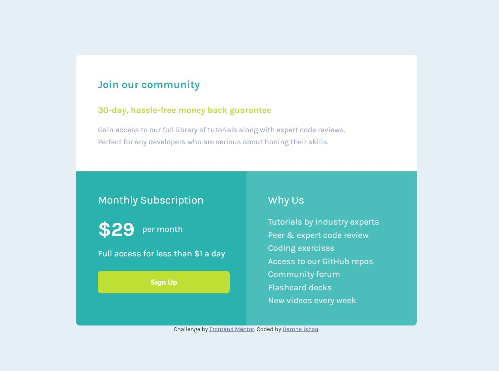

# Frontend Mentor - Single price grid component solution

This is a solution to the [Single price grid component challenge on Frontend Mentor](https://www.frontendmentor.io/challenges/single-price-grid-component-5ce41129d0ff452fec5abbbc).

## Table of contents

- [Overview](#overview)
  - [The challenge](#the-challenge)
  - [Screenshot](#screenshot)
  - [Links](#links)
- [My process](#my-process)
  - [Built with](#built-with)
  - [What I learned](#what-i-learned)
  - [Useful resources](#useful-resources)
- [Author](#author)

## Overview

### The challenge
Code the provided design for "Single Proce Grid Component" for mobile and desktop devices.

Users should be able to:

- View the optimal layout for the component depending on their device's screen size
- See a hover state on desktop for the Sign Up call-to-action

### Screenshot

### Links

- Solution URL: [Code Link](https://github.com/HamnaIshaq/single-price-grid-)
- Live Site URL: [Live Link](https://hamnaishaq.github.io/single-price-grid-/)

## My process

### Built with

- Semantic HTML5 markup
- CSS custom properties
- Flexbox
- Mobile-first workflow

### What I learned

In this project, I learnt and tried using CSS units relative to font-size, in particular, "rem" and "em". 

### Useful resources

- [Introduction To Responsive Web Design - HTML & CSS Tutorial](https://www.youtube.com/watch?v=srvUrASNj0s&t=34s) - This video really helped me in understanding how to approach responsive design. The instructor, Kevin Powell, is an amazing teacher and expalins HTML and CSS concepts really well. I would strongly recommend this video to anyone starting out and struggling with responsive design concepts.

## Author
- Frontend Mentor - [@HamnaIshaq](https://www.frontendmentor.io/profile/HamnaIshaq)
